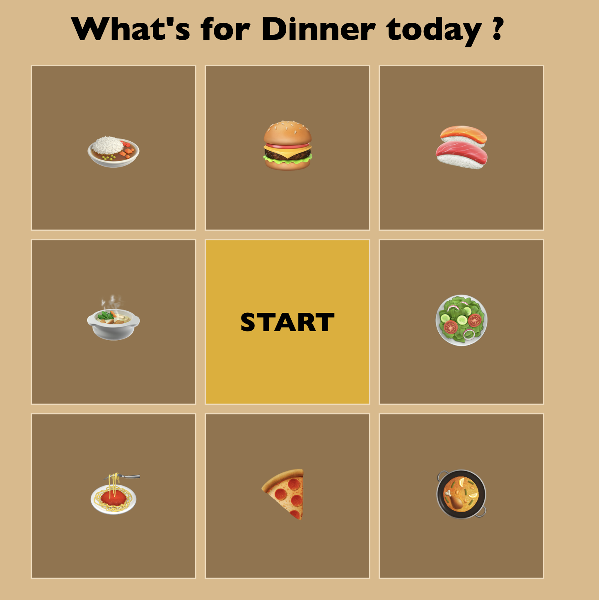

# Dinner Game 今晚想來點什麼？ 👩🏻‍🍳

動態畫面

靜態畫面

## 📌 專案目的

解決現代人晚餐總是難有任何想法，透過輪盤遊戲的方式，隨機選出你今天的晚餐是什麼！

## 🎯 專案功能

- 點擊中間的“Start"開始遊戲
- 輪盤會根據速度的快慢進行運轉，同時以黃色外框樣式顯示每次輪盤到達的位置
- 當輪盤遊戲結束時，會跳出提示框說明選中的晚餐為何

## ✔️ 專案使用

1. 將專案 clone 到本地
2. 在本地開啟之後，透過終端機進入資料夾
3. 打開瀏覽器，並輸入 http://127.0.0.1:5500/ 進入首頁

## 🎮 立即體驗

點按即進入遊戲：https://cching01099.github.io/DinnerGame/
